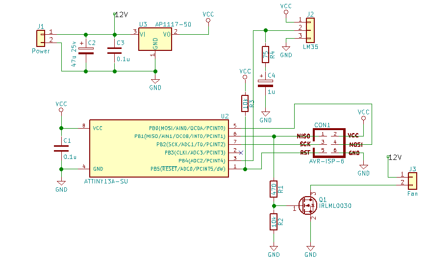

Power supply fan controller
===========================

Many lab power supplies have annoying fans that spins all the time.
The fan produces noise even though the power supply usually works with small
currents and do not heat up at all. This mod turns on the fan only when
it is needed, when temperature of the heatsink is rising.

## Features

 * Use temperature sensor to gradually increase fan speed
 * Easy configurable temperature and fan speed table
 * Test fan on start-up
 * Uses LM35 temperature sensor

## Schematic

## Licence

MIT

